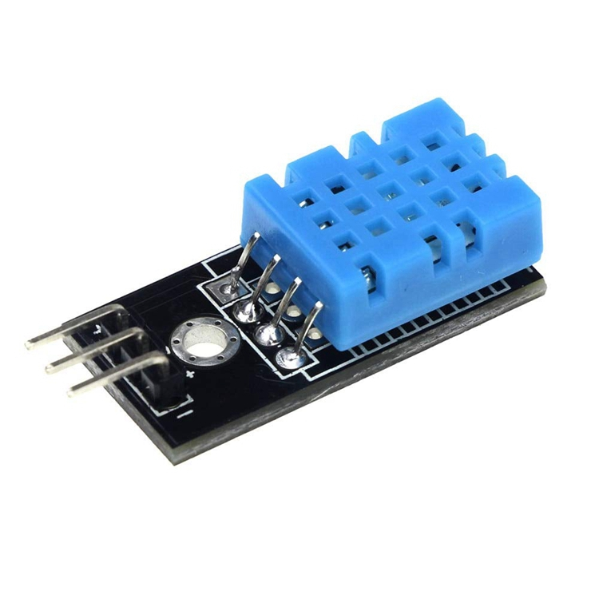
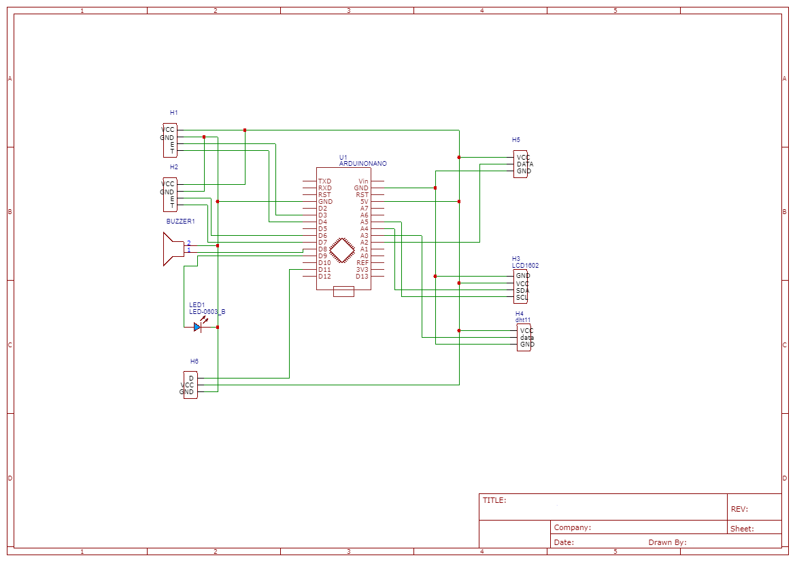

# ece387final_project
smart trash can

## Introduction:

The embedded system project to be designed and produced this time is a smart trash can. This is a small version of the smart trash can. First of all, he has a sensor switch, when it senses that you are about to throw out garbage. His lid will open automatically. This is the basic function of the smart trash can.

## The purpose of the project:
By making related projects, you can improve your programming level. And can better understand what embedded system is. The smart trash can is a project close to our lives. It can better experience the convenience of human beings brought by embedded systems.

## Here is the Materials and equipment you need for the project:

1. A small size trash can
 
2. Arduino Uno
 
3. HC-SR04 Ultrasonic Distance Sensor（*2)
 
4. LDR Sensor Module Interface
 
5. DHT11 Temperature And Relative Humidity Sensor Module
 
5. LED 5mm （*5）
 
6. Male/Female Jumper Wires 
 
7. LCD1602A BLUEE SCREEN 
 
8. Servo Motor SG-90
 
9. Buzzer Active 5V Module （*2）
 
10. A Hot Glue Gun
 
11. Some paper boxes as auxiliary materials
Finished!

## Final result‘s picture
Since the optional trash can does not have a lid, we need to use the paper box to cut out a suitable size for the lid of the trash can. It should be noted that since our design is an automatic switch cover, its power drive is a servo motor. Therefore, it is very important to appropriately reduce the weight of the lid itself.
At the same time, we need to use a hot melt gun to glue all the modules together so that all the equipment becomes a whole.

1. A small size trash can
 

## Circuit diagram
1.Here is the circuit diagram:

## Project video
Video：https://www.youtube.com/embed/cQ0-9XSofic
